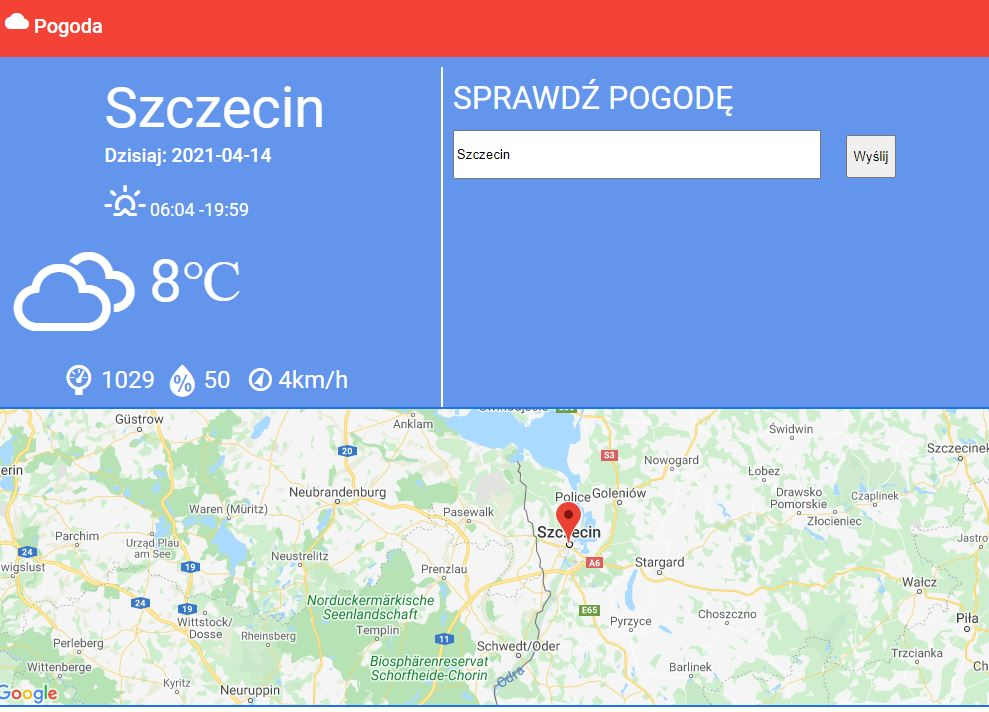
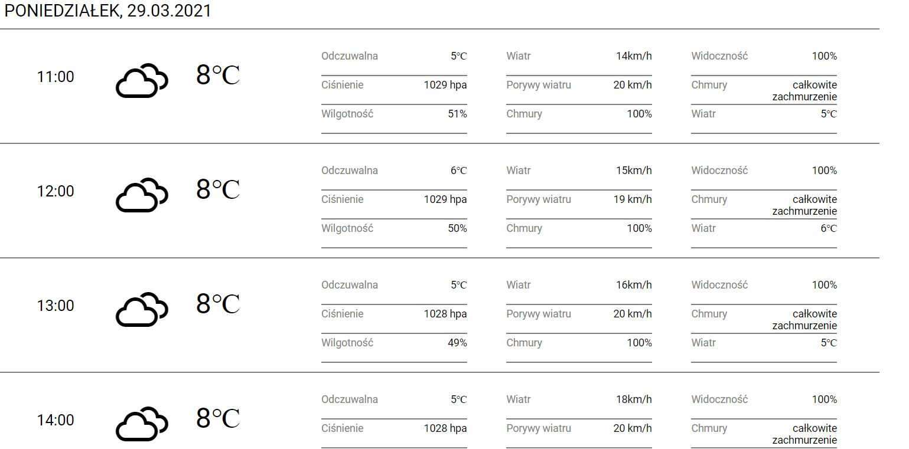

# WeatherApp

## Description
ds

## Functionalities
<ul>
<li>
Map
  <ul>
    <li>Marking place on map</li>
    <li>Marking place on map after type name of city</li>
    <li>Viewing data about weather after marker place on map </li>
  </ul>
</li>
  <li>
 Current Weather
  <ul>
    <li>Viewing main stats about weather at the moment</li>
    <li>Display icon of weather depending on the weather</li>
    <li>The precise date of sunrise and sunset for searched city.</li>
  </ul>
</li>
  <li>
Daily Weather hour after hour
  <ul>
    <li>Display detail of weather hour after hour</li>
    <li>Display icon of predicted weather</li>
    <li>Paginate for hours.</li>
  </ul>
</li>

</ul>  

## App
Few photos from app 
1. Aktualna pogoda

2. Godzinowa Pogoda szczegołowa

